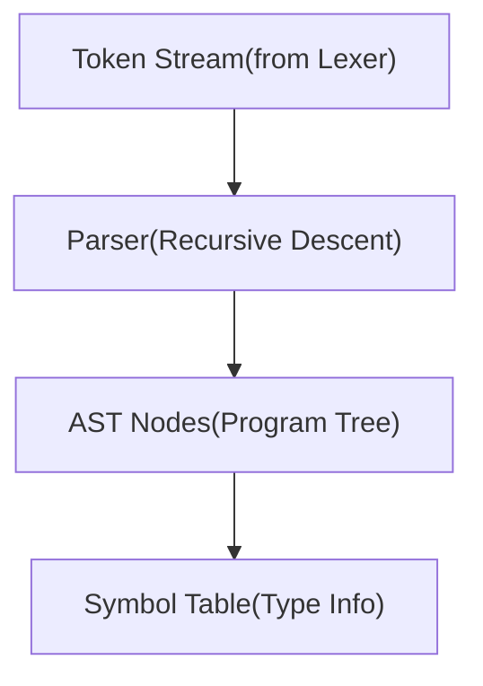

# <div align=center>0xParser</div>


## Overview

**0xParser** is a robust, production-ready recursive descent parser for a C-like programming language. It implements a full lexical analysis and syntax analysis pipeline, generating Abstract Syntax Trees (AST) that can be used for code generation, interpretation, or static analysis.

### Key Features

- **Complete C-subset Support**: Variables, functions, control flow, expressions
- **Recursive Descent Parsing**: Predictable, maintainable parsing strategy
- **Comprehensive AST**: Full tree representation with line/column tracking
- **Symbol Table Management**: Type checking and scope management
- **Error Recovery**: Synchronization points for continued parsing after errors
- **Standard Library Integration**: Built-in support for `printf`, `scanf`, `malloc`, `free`
- **Operator Precedence**: Correct handling of arithmetic and logical operators
- **Type System**: Support for `int`, `float`, `char`, `void`, and pointer types

### Version Information

- **Version**: 3.0
- **Status**: Stable
- **Author**: ALI RAZA
- **Repository**: https://github.com/0xAli-Raza/AdvancedParser

---

## Architecture

### System Design



### Component Hierarchy

1. **Token Layer**: Lexical tokens with metadata (line, column)
2. **Parser Layer**: Syntax analysis and AST construction
3. **AST Layer**: Tree representation of program structure
4. **Symbol Table Layer**: Semantic information and type tracking

---

## Installation & Setup

### Prerequisites

```bash
bash

Python 3.7+
colorama>=0.4.0
```

### Installation

```bash
bash
#Clone the repository
git clone https://github.com/0xAli-Raza/AdvancedParser.git
cd AdvancedParser
#Install dependencies
pip install colorama
#Run the parser
python parser.py
```

### Quick Start

```python

from parser import Parser, print_ast
#Define your tokens (typically from a lexer)
tokens = [
('KEYWORD', 'int', 1, 0),
('IDENTIFIER', 'main', 1, 4),
('LPAREN', '(', 1, 8),
('RPAREN', ')', 1, 9),
('LBRACE', '{', 1, 11),
('KEYWORD', 'return', 2, 4),
('INTEGER_LITERAL', '0', 2, 11),
('SEMICOLON', ';', 2, 12),
('RBRACE', '}', 3, 0),
('EOF', '', 3, 1)
]

#Parse the tokens
parser = Parser(tokens)
ast = parser.parse()
#Display the AST
if not parser.errors:
print_ast(ast)
else:
for error in parser.errors:
print(error)
```

---

## Core Components

### 1. Token Class

Represents a lexical token with position tracking.

```python
class Token:
    def __init__(self, token_type, lexeme, line, col):
        self.type = token_type      # Token category (KEYWORD, IDENTIFIER, etc.)
        self.lexeme = lexeme        # Actual text
        self.line = line            # Line number in source
        self.col = col              # Column number in source
```

**Supported Token Types**:

- `KEYWORD`: Reserved words (`int`, `if`, `while`, etc.)
- `IDENTIFIER`: Variable/function names
- `INTEGER_LITERAL`: Integer constants
- `FLOAT_LITERAL`: Floating-point constants
- `STRING_LITERAL`: String constants
- `OPERATOR`: Arithmetic, logical, comparison operators
- `LPAREN`, `RPAREN`: Parentheses `(` `)`
- `LBRACE`, `RBRACE`: Braces `{` `}`
- `SEMICOLON`: Statement terminator `;`
- `COMMA`: Parameter separator `,`
- `EOF`: End of file marker

### 2. Parser Class

Main parsing engine implementing recursive descent strategy.

```python
class Parser:
    def __init__(self, tokens):
        self.tokens = [...]          # Token stream
        self.pos = 0                # Current position
        self.current_token = ...    # Current token
        self.symbol_table = ...     # Symbol tracking
        self.errors = []            # Error collection
        self.loop_depth = 0         # Loop nesting level
        self.function_depth = 0     # Function nesting level
```

**Key Methods**:

| Method | Purpose |
| --- | --- |
| `parse()` | Entry point for parsing |
| `advance()` | Move to next token |
| `check(type, lexeme)` | Verify current token |
| `match(type, lexeme)` | Consume matching token |
| `expect(type, lexeme)` | Require specific token |
| `synchronize()` | Error recovery |

### 3. Symbol Table

Tracks declarations and type information.

```python
class SymbolTable:
    def __init__(self):
        self.symbols = {}            # name -> Symbol mapping
        self._add_stdlib()           # Add standard library

    def declare(name, var_type, ...):
        """Register a new symbol"""

    def lookup(name):
        """Find symbol by name"""

    def exists(name):
        """Check if symbol exists"""
```

**Standard Library Functions**:

- `printf(format, ...)` → `int`
- `scanf(format, ...)` → `int`
- `malloc(size)` → `void*`
- `free(ptr)` → `void`

---

## AST Node Reference

### Base Class

```python
class ASTNode:
    def __init__(self, line=None, col=None):
        self.line = line    # Source line number
        self.col = col      # Source column number
```

### Node Types

### Program Node

```python
class Program(ASTNode):
    def __init__(self, statements):
        self.statements = statements  # List of top-level statements
```

### Expression Nodes

**Number**

```python
class Number(ASTNode):
    def __init__(self, value, line=None, col=None):
        self.value = value  # Numeric value (int or float)
```

**Identifier**

```python
class Identifier(ASTNode):
    def __init__(self, name, line=None, col=None):
        [self.name](http://self.name) = name    # Variable/function name
```

**StringLiteral**

```python
class StringLiteral(ASTNode):
    def __init__(self, value, line=None, col=None):
        self.value = value  # String content
```

**BinaryOp**

```python
class BinaryOp(ASTNode):
    def __init__(self, operator, left, right, line=None, col=None):
        self.operator = operator  # +, -, *, /
        self.left = left          # Left operand
        self.right = right        # Right operand
```

**ComparisonOp**

```python
class ComparisonOp(ASTNode):
    def __init__(self, operator, left, right, line=None, col=None):
        self.operator = operator  # ==, !=, <, >, <=, >=
        self.left = left
        self.right = right
```

**LogicalOp**

```python
class LogicalOp(ASTNode):
    def __init__(self, operator, left, right=None, line=None, col=None):
        self.operator = operator  # &&, ||, !
        self.left = left
        self.right = right        # None for unary !
```

### Declaration Nodes

**VarDeclaration**

```python
class VarDeclaration(ASTNode):
    def __init__(self, var_type, identifier, value=None, line=None, col=None):
        self.var_type = var_type      # int, float, char
        self.identifier = identifier  # Variable name
        self.value = value            # Initialization expression (optional)
```

**FunctionDeclaration**

```python
class FunctionDeclaration(ASTNode):
    def __init__(self, return_type, name, parameters, body, line=None, col=None):
        self.return_type = return_type  # Return type
        [self.name](http://self.name) = name                # Function name
        self.parameters = parameters    # List of Parameter nodes
        self.body = body                # Block node
```

**Parameter**

```python
class Parameter(ASTNode):
    def __init__(self, param_type, name, line=None, col=None):
        self.param_type = param_type  # Parameter type
        [self.name](http://self.name) = name              # Parameter name
```

### Statement Nodes

**Assignment**

```python
class Assignment(ASTNode):
    def __init__(self, identifier, value, line=None, col=None):
        self.identifier = identifier  # Variable name
        self.value = value            # Expression to assign
```

**CompoundAssignment**

```python
class CompoundAssignment(ASTNode):
    def __init__(self, identifier, operator, value, line=None, col=None):
        self.identifier = identifier  # Variable name
        self.operator = operator      # +=, -=, *=, /=
        self.value = value            # Expression
```

**IfStatement**

```python
class IfStatement(ASTNode):
    def __init__(self, condition, then_block, else_block=None, line=None, col=None):
        self.condition = condition      # Boolean expression
        self.then_block = then_block    # Statement/Block
        self.else_block = else_block    # Optional else clause
```

**WhileStatement**

```python
class WhileStatement(ASTNode):
    def __init__(self, condition, body, line=None, col=None):
        self.condition = condition  # Loop condition
        self.body = body            # Loop body
```

**ForStatement**

```python
class ForStatement(ASTNode):
    def __init__(self, init, condition, update, body, line=None, col=None):
        self.init = init            # Initialization
        self.condition = condition  # Loop condition
        self.update = update        # Update expression
        self.body = body            # Loop body
```

**Block**

```python
class Block(ASTNode):
    def __init__(self, statements, line=None, col=None):
        self.statements = statements  # List of statements
```

**ReturnStatement**

```python
class ReturnStatement(ASTNode):
    def __init__(self, value=None, line=None, col=None):
        self.value = value  # Return expression (optional)
```

**BreakStatement / ContinueStatement**

```python
class BreakStatement(ASTNode):
    pass

class ContinueStatement(ASTNode):
    pass
```

**FunctionCall**

```python
class FunctionCall(ASTNode):
    def __init__(self, name, arguments, line=None, col=None):
        [self.name](http://self.name) = name            # Function name
        self.arguments = arguments  # List of argument expressions
```

---

## Parser API

### Parsing Methods

### `parse() -> Program`

Entry point for parsing. Returns a Program node containing all top-level declarations and statements.

```python
ast = parser.parse()
if not parser.errors:
    print("Parsing successful!")
```

### `program() -> Program`

Parses the entire program structure.

Grammar:

```
program → declaration_or_statement* EOF
```

### `declaration_or_statement() -> ASTNode`

Distinguishes between function declarations and statements.

Grammar:

```
declaration_or_statement → function_declaration | statement
```

### Declaration Methods

### `function_declaration() -> FunctionDeclaration`

Parses function definitions.

Grammar:

```
function_declaration → type IDENTIFIER '(' parameter_list ')' block
```

Example:

```c
int add(int a, int b) {
    return a + b;
}
```

### `parameter_list() -> List[Parameter]`

Parses function parameters.

Grammar:

```
parameter_list → (parameter (',' parameter)*)?
```

### `declaration() -> VarDeclaration`

Parses variable declarations.

Grammar:

```
declaration → type IDENTIFIER ('=' expression)? ';'
```

Example:

```c
int x = 10;
float pi = 3.14;
```

### Statement Methods

### `statement() -> ASTNode`

Dispatches to appropriate statement parser.

Grammar:

```
statement → declaration
          | if_statement
          | while_statement
          | for_statement
          | break_statement
          | continue_statement
          | return_statement
          | block
          | assignment
          | compound_assignment
          | expression_statement
```

### `if_statement() -> IfStatement`

Parses conditional statements.

Grammar:

```
if_statement → 'if' '(' logical_or_expression ')' statement ('else' statement)?
```

Example:

```c
if (x > 10) {
    y = 20;
} else {
    y = 5;
}
```

### `while_statement() -> WhileStatement`

Parses while loops.

Grammar:

```
while_statement → 'while' '(' logical_or_expression ')' statement
```

### `for_statement() -> ForStatement`

Parses for loops.

Grammar:

```
for_statement → 'for' '(' (declaration | assignment | ε) ';'
                             logical_or_expression? ';'
                             (assignment | compound_assignment)? ')'
                             statement
```

Example:

```c
for (int i = 0; i < 10; i += 1) {
    sum += i;
}
```

### `block() -> Block`

Parses code blocks.

Grammar:

```
block → '{' statement* '}'
```

### Expression Methods

### Expression Precedence Hierarchy

```
logical_or_expression      (lowest precedence)
    ↓
logical_and_expression
    ↓
Equality_expression
    ↓
relational_expression
    ↓
expression (addition/subtraction)
    ↓
term (multiplication/division)
    ↓
factor (unary, literals, identifiers)  (highest precedence)
```

### `expression() -> ASTNode`

Parses addition and subtraction.

Grammar:

```
expression → term (('+' | '-') term)*
```

### `term() -> ASTNode`

Parses multiplication, division, and modulus.

Grammar:

```
term → factor (('*' | '/' | '%') factor)*
```

### `factor() -> ASTNode`

Parses primary expressions.

Grammar:

```
factor → INTEGER_LITERAL
       | FLOAT_LITERAL
       | STRING_LITERAL
       | IDENTIFIER
       | function_call
       | '!' factor
       | '(' logical_or_expression ')'
```

### `logical_or_expression() -> ASTNode`

Parses logical OR operations.

Grammar:

```
logical_or_expression → logical_and_expression ('||' logical_and_expression)*
```

### `logical_and_expression() -> ASTNode`

Parses logical AND operations.

Grammar:

```
logical_and_expression → equality_expression ('&&' equality_expression)*
```

### `equality_expression() -> ASTNode`

Parses equality comparisons.

Grammar:

```
equality_expression → relational_expression (('==' | '!=') relational_expression)*
```

### `relational_expression() -> ASTNode`

Parses relational comparisons.

Grammar:

```
relational_expression → expression (('<' | '>' | '<=' | '>=') expression)*
```

---

## Grammar Specification

### Complete EBNF Grammar

```ebnf
program                 → declaration_or_statement* EOF

declaration_or_statement → function_declaration | statement

function_declaration    → type IDENTIFIER '(' parameter_list ')' block

parameter_list          → (parameter (',' parameter)*)?
parameter               → type IDENTIFIER

statement               → declaration
                        | if_statement
                        | while_statement
                        | for_statement
                        | break_statement
                        | continue_statement
                        | return_statement
                        | block
                        | assignment
                        | compound_assignment
                        | expression_statement

declaration             → type IDENTIFIER ('=' expression)? ';'

assignment              → IDENTIFIER '=' expression ';'

compound_assignment     → IDENTIFIER ('+=' | '-=' | '*=' | '/=') expression ';'

if_statement            → 'if' '(' logical_or_expression ')' statement
                           ('else' statement)?

while_statement         → 'while' '(' logical_or_expression ')' statement

for_statement           → 'for' '(' (declaration | assignment | ε) ';'
                                      logical_or_expression? ';'
                                      (assignment | compound_assignment)? ')'
                           statement

break_statement         → 'break' ';'

continue_statement      → 'continue' ';'

return_statement        → 'return' expression? ';'

block                   → '{' statement* '}'

expression_statement    → expression ';'

logical_or_expression   → logical_and_expression ('||' logical_and_expression)*

logical_and_expression  → equality_expression ('&&' equality_expression)*

equality_expression     → relational_expression (('==' | '!=') relational_expression)*

relational_expression   → expression (('<' | '>' | '<=' | '>=') expression)*

expression              → term (('+' | '-') term)*

term                    → factor (('*' | '/' | '%') factor)*

factor                  → INTEGER_LITERAL
                        | FLOAT_LITERAL
                        | STRING_LITERAL
                        | IDENTIFIER
                        | function_call
                        | '!' factor
                        | '(' logical_or_expression ')'

function_call           → IDENTIFIER '(' argument_list ')'

argument_list           → (expression (',' expression)*)?

type                    → 'int' | 'float' | 'char' | 'void'
```

### Operator Precedence Table

| Precedence | Operators | Associativity | Description |
| --- | --- | --- | --- |
| 1 (highest) | `()` | Left-to-right | Parentheses, function call |
| 2 | `!` | Right-to-left | Logical NOT |
| 3 | `*` `/` `%` | Left-to-right | Multiplication, division, modulus |
| 4 | `+` `-` | Left-to-right | Addition, subtraction |
| 5 | `<` `>` `<=` `>=` | Left-to-right | Relational comparison |
| 6 | `==` `!=` | Left-to-right | Equality comparison |
| 7 | `&&` | Left-to-right | Logical AND |
| 8 (lowest) | ` |  | ` |

---

## Error Handling

### Error Detection

The parser detects several classes of errors:

1. **Syntax Errors**: Unexpected tokens, missing punctuation
2. **Semantic Errors**: Break/continue outside loops, return outside functions
3. **Type Errors**: Tracked via symbol table

### Error Reporting

```python
parser.errors  # List of error messages
# Error format: "Syntax Error at line:col - message"
```

Example error:

```
Syntax Error at 5:12 - Expected SEMICOLON:';', got IDENTIFIER:'x'
```

### Error Recovery

The parser implements **panic mode recovery** via synchronization:

```python
def synchronize(self):
    """Skip tokens until a recovery point is found"""
    sync_tokens = {'SEMICOLON', 'EOF', 'RBRACE'}
    sync_keywords = {'int', 'float', 'char', 'void', 'if', 'while', 'for', 'return'}

    while self.current_token:
        if self.current_token.type in sync_tokens:
            if self.current_token.type == 'SEMICOLON':
                self.advance()
            return

        if self.current_token.type == 'KEYWORD' and \
           self.current_token.lexeme in sync_keywords:
            return

        self.advance()
```

**Recovery Points**:

- Semicolons (`;`)
- Closing braces (`}`)
- Keywords starting new statements
- EOF

### Best Practices

1. **Check errors after parsing**:

```python
ast = parser.parse()
if parser.errors:
    for error in parser.errors:
        print(error)
    exit(1)
```

1. **Validate semantic constraints**:

```python
if self.loop_depth == 0:
    [self.report](http://self.report)_error("'break' not inside loop")
```

1. **Provide helpful error messages**:

```python
expected = f"{token_type}" + (f":'{lexeme}'" if lexeme else "")
actual = f"{self.current_token.type}:'{self.current_token.lexeme}'"
[self.report](http://self.report)_error(f"Expected {expected}, got {actual}")
```

---

## Symbol Table

### Symbol Structure

```python
class Symbol:
    def __init__(self, name, var_type, is_function=False, params=None, value=None):
        [self.name](http://self.name) = name              # Symbol name
        self.var_type = var_type      # Type (int, float, etc.)
        [self.is](http://self.is)_function = is_function # Function flag
        self.params = params          # Function parameters
        self.value = value            # Initial value (for variables)
        [self.is](http://self.is)_variadic = False      # Variadic function flag
```

### Operations

### Declare a Symbol

```python
parser.symbol_table.declare('x', 'int', value=10)
parser.symbol_table.declare('add', 'int', is_function=True, params=[...])
```

### Lookup a Symbol

```python
symbol = parser.symbol_table.lookup('x')
if symbol:
    print(f"Found: {[symbol.name](http://symbol.name)} of type {symbol.var_type}")
```

### Check Existence

```python
if parser.symbol_table.exists('x'):
    print("Variable 'x' is already declared")
```

### Standard Library

Pre-defined symbols:

```python
{
    'printf': Symbol('printf', 'int', is_function=True, is_variadic=True),
    'scanf': Symbol('scanf', 'int', is_function=True, is_variadic=True),
    'malloc': Symbol('malloc', 'void*', is_function=True),
    'free':  Symbol('free', 'void', is_function=True)
}
```

---

## Usage Examples

### Example 1: Simple Variable Declaration

**Input Code**:

```c
int main() {
    int x = 10;
    return 0;
}
```

**Tokens**:

```python
tokens = [
    ('KEYWORD', 'int', 1, 0),
    ('IDENTIFIER', 'main', 1, 4),
    ('LPAREN', '(', 1, 8),
    ('RPAREN', ')', 1, 9),
    ('LBRACE', '{', 1, 11),
    ('KEYWORD', 'int', 2, 4),
    ('IDENTIFIER', 'x', 2, 8),
    ('OPERATOR', '=', 2, 10),
    ('INTEGER_LITERAL', '10', 2, 12),
    ('SEMICOLON', ';', 2, 14),
    ('KEYWORD', 'return', 3, 4),
    ('INTEGER_LITERAL', '0', 3, 11),
    ('SEMICOLON', ';', 3, 12),
    ('RBRACE', '}', 4, 0),
    ('EOF', '', 4, 1)
]
```

**AST Output**:

```
Program
  [0]: FunctionDeclaration(int main)
    params: []
    body: Block
      [0]: VarDeclaration(int x)
        value: Number(10)
      [1]: ReturnStatement
        value: Number(0)
```

### Example 2: If-Else Statement

**Input Code**:

```c
int main() {
    int x = 5;
    if (x > 10) {
        x = 20;
    } else {
        x = 5;
    }
    return x;
}
```

**AST Structure**:

```
Program
  [0]: FunctionDeclaration(int main)
    body: Block
      [0]: VarDeclaration(int x)
        value: Number(5)
      [1]: IfStatement
        condition: ComparisonOp('>')
          left: Identifier(x)
          right: Number(10)
        then: Block
          [0]: Assignment('x')
            value: Number(20)
        else: Block
          [0]: Assignment('x')
            value: Number(5)
      [2]: ReturnStatement
        value: Identifier(x)
```

### Example 3: For Loop

**Input Code**:

```c
int main() {
    int sum = 0;
    for (int i = 0; i < 10; i += 1) {
        sum += i;
    }
    return sum;
}
```

**AST Structure**:

```
Program
  [0]: FunctionDeclaration(int main)
    body: Block
      [0]: VarDeclaration(int sum)
        value: Number(0)
      [1]: ForStatement
        init: VarDeclaration(int i)
          value: Number(0)
        condition: ComparisonOp('<')
          left: Identifier(i)
          right: Number(10)
        update: CompoundAssignment('i' +=)
          value: Number(1)
        body: Block
          [0]: CompoundAssignment('sum' +=)
            value: Identifier(i)
      [2]: ReturnStatement
        value: Identifier(sum)
```

### Example 4: Function Definition and Call

**Input Code**:

```c
int add(int a, int b) {
    return a + b;
}

int main() {
    int result = add(10, 20);
    return result;
}
```

**AST Structure**:

```
Program
  [0]: FunctionDeclaration(int add)
    params: [Parameter(int a), Parameter(int b)]
    body: Block
      [0]: ReturnStatement
        value: BinaryOp('+')
          left: Identifier(a)
          right: Number(20)
  [1]: FunctionDeclaration(int main)
    body: Block
      [0]: VarDeclaration(int result)
        value: FunctionCall(add)
          arg[0]: Number(10)
          arg[1]: Number(20)
      [1]: ReturnStatement
        value: Identifier(result)
```

---

## Testing

### Test Suite

The parser includes a comprehensive test suite with 15 test cases covering:

1. Simple main function
2. Multiple variable types
3. Arithmetic operations
4. Assignments
5. Compound assignments
6. If statements
7. If-else statements
8. While loops
9. For loops
10. Break statements
11. Continue statements
12. Function declarations
13. Function calls
14. Logical operators
15. Nested loops

### Running Tests

```bash
python [parser.py](http://parser.py)
```

### Test Output Format

```
══════════════════════════════════════════════════════════════════
TEST 1: Simple Main Function
──────────────────────────────────────────────────────────────────
 ✓ INPUT CODE:
──────────────────────────────────────────────────────────────────
int main() {
    int x = 10;
    return 0;
}
──────────────────────────────────────────────────────────────────
 ✓ TOKENS:
──────────────────────────────────────────────────────────────────
  KEYWORD              'int'  @ 1:0
  IDENTIFIER           'main'  @ 1:4
  ...
 ✓ PARSE TREE:
──────────────────────────────────────────────────────────────────
Program
  [0]: FunctionDeclaration(int main)
    ...
 ✓ PARSING SUCCESSFUL!
──────────────────────────────────────────────────────────────────
```

### Adding Custom Tests

```python
test_case = {
    "name": "Your Test Name",
    "code": """
        int main() {
            // Your code here
        }
    """,
    "tokens": [
        # Your token list
    ]
}

# Add to test_cases list in run_parser_tests()
```

---

## Performance Considerations

### Time Complexity

| Operation | Complexity | Notes |
| --- | --- | --- |
| Token lookup | O(1) | Direct array access |
| Symbol lookup | O(1) | Dictionary-based |
| Parsing statement | O(n) | Linear in tokens |
| Full parse | O(n) | Single pass over tokens |
| AST traversal | O(n) | Linear in nodes |

### Space Complexity

- **Token storage**: O(n) where n = number of tokens
- **AST storage**: O(m) where m = number of AST nodes
- **Symbol table**: O(s) where s = number of symbols
- **Call stack**: O(d) where d = max nesting depth

### Optimization Tips

1. **Token Stream**: Pre-allocate token list for large files
2. **Symbol Table**: Use hash-based dictionary (O(1) lookup)
3. **AST Construction**: Avoid deep copying, use references
4. **Error Recovery**: Limit synchronization attempts

### Memory Management

```python
# Clear parser state after use
parser = None
ast = None

# Process AST in chunks for large programs
for statement in ast.statements:
    process(statement)
    del statement  # Free memory
```

---

**Auther:** ALI RAZA

**Last Updated:** 31 Dec, 2025
