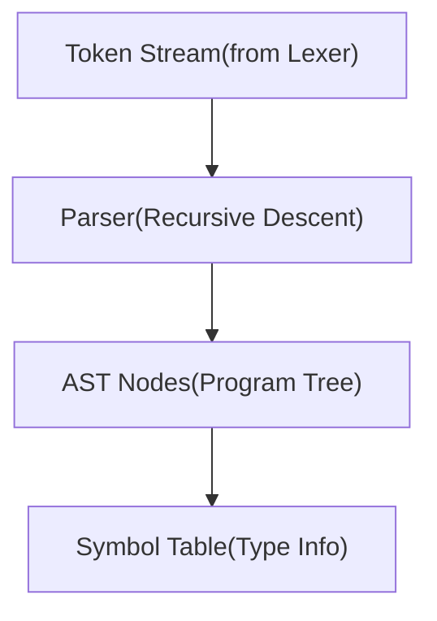

---

<div align="center">
  
</div>

---


## Overview

**Parser** is a robust, production-ready recursive descent parser for a C-like programming language. It implements a full lexical analysis and syntax analysis pipeline, generating Abstract Syntax Trees (AST) that can be used for code generation, interpretation, or static analysis.

### Key Features

- **Complete C-subset Support**: Variables, functions, control flow, expressions
- **Recursive Descent Parsing**: Predictable, maintainable parsing strategy
- **Comprehensive AST**: Full tree representation with line/column tracking
- **Symbol Table Management**: Type checking and scope management
- **Error Recovery**: Synchronization points for continued parsing after errors
- **Standard Library Integration**: Built-in support for `printf`, `scanf`, `malloc`, `free`
- **Operator Precedence**: Correct handling of arithmetic and logical operators
- **Type System**: Support for `int`, `float`, `char`, `void`, and pointer types

### Version Information

- **Version**: 3.0
- **Status**: Stable
- **Author**: ALI RAZA
- **Repository**: https://github.com/0xAli-Raza/AdvancedParser

---

## Architecture

### System Design



### Component Hierarchy

1. **Token Layer**: Lexical tokens with metadata (line, column)
2. **Parser Layer**: Syntax analysis and AST construction
3. **AST Layer**: Tree representation of program structure
4. **Symbol Table Layer**: Semantic information and type tracking

---

## Installation & Setup

### Prerequisites

```bash
bash

Python 3.7+
colorama>=0.4.0
```

### Installation

```bash
bash
#Clone the repository
git clone https://github.com/0xAli-Raza/AdvancedParser.git
cd AdvancedParser
#Install dependencies
pip install colorama
#Run the parser
python parser.py
```


---

## Quick Start

```python
from parser import Parser, print_ast

# Define your tokens (token_type, lexeme, line, column)
tokens = [
    ('KEYWORD', 'int', 1, 0),
    ('IDENTIFIER', 'main', 1, 4),
    ('LPAREN', '(', 1, 8),
    ('RPAREN', ')', 1, 9),
    ('LBRACE', '{', 1, 11),
    ('KEYWORD', 'return', 2, 4),
    ('INTEGER_LITERAL', '0', 2, 11),
    ('SEMICOLON', ';', 2, 12),
    ('RBRACE', '}', 3, 0),
    ('EOF', '', 3, 1)
]

# Create parser and parse
parser = Parser(tokens)
ast = parser.parse()

# Print the AST
if not parser.errors:
    print_ast(ast)
else:
    for error in parser.errors:
        print(error)
```

## Architecture

### Core Components

#### 1. **Token Class**
Represents individual lexical tokens with position information.

```python
class Token:
    def __init__(self, token_type, lexeme, line, col):
        self.type = token_type
        self.lexeme = lexeme
        self.line = line
        self.col = col
```

#### 2. **AST Nodes**
Hierarchical node classes representing different language constructs:

- `Program` - Root node containing all statements
- `FunctionDeclaration` - Function definitions
- `VarDeclaration` - Variable declarations
- `IfStatement`, `WhileStatement`, `ForStatement` - Control structures
- `BinaryOp`, `ComparisonOp`, `LogicalOp` - Expressions
- `Assignment`, `CompoundAssignment` - Assignment operations
- `FunctionCall`, `ReturnStatement` - Function operations

#### 3. **Parser**
Recursive descent parser implementing the C grammar.

#### 4. **Symbol Table**
Manages declared symbols with type information and scope.

### Grammar Support

The parser implements a subset of C grammar including:

- **Declarations**: Variable and function declarations
- **Statements**: Assignment, compound assignment, expression statements
- **Control Flow**: if-else, while, for loops
- **Loop Control**: break, continue
- **Functions**: Declaration, calls, return statements
- **Expressions**: Binary operations, comparisons, logical operations
- **Literals**: Integers, floats, strings

## Supported Constructs

### Data Types
- `int` - Integer type
- `float` - Floating-point type
- `char` - Character type
- `void` - Void type (for functions)

### Operators

**Arithmetic**: `+`, `-`, `*`, `/`, `%`

**Comparison**: `==`, `!=`, `<`, `>`, `<=`, `>=`

**Logical**: `&&`, `||`, `!`

**Assignment**: `=`, `+=`, `-=`, `*=`, `/=`

### Control Structures

**Conditional**:
```c
if (condition) {
    // statements
} else {
    // statements
}
```

**Loops**:
```c
while (condition) {
    // statements
}

for (init; condition; update) {
    // statements
}
```

**Loop Control**:
```c
break;     // Exit loop
continue;  // Skip to next iteration
```

### Functions

**Declaration**:
```c
int functionName(int param1, float param2) {
    // statements
    return value;
}
```

**Function Calls**:
```c
result = functionName(arg1, arg2);
```

## Usage Examples

### Example 1: Simple Variable Declaration

```python
tokens = [
    ('KEYWORD', 'int', 1, 0),
    ('IDENTIFIER', 'x', 1, 4),
    ('OPERATOR', '=', 1, 6),
    ('INTEGER_LITERAL', '10', 1, 8),
    ('SEMICOLON', ';', 1, 10),
    ('EOF', '', 1, 11)
]

parser = Parser(tokens)
ast = parser.parse()
```

### Example 2: Function with Control Flow

```python
tokens = [
    ('KEYWORD', 'int', 1, 0),
    ('IDENTIFIER', 'max', 1, 4),
    ('LPAREN', '(', 1, 7),
    ('KEYWORD', 'int', 1, 8),
    ('IDENTIFIER', 'a', 1, 12),
    ('COMMA', ',', 1, 13),
    ('KEYWORD', 'int', 1, 15),
    ('IDENTIFIER', 'b', 1, 19),
    ('RPAREN', ')', 1, 20),
    ('LBRACE', '{', 1, 22),
    ('KEYWORD', 'if', 2, 4),
    ('LPAREN', '(', 2, 7),
    ('IDENTIFIER', 'a', 2, 8),
    ('OPERATOR', '>', 2, 10),
    ('IDENTIFIER', 'b', 2, 12),
    ('RPAREN', ')', 2, 13),
    ('LBRACE', '{', 2, 15),
    ('KEYWORD', 'return', 3, 8),
    ('IDENTIFIER', 'a', 3, 15),
    ('SEMICOLON', ';', 3, 16),
    ('RBRACE', '}', 4, 4),
    ('KEYWORD', 'return', 5, 4),
    ('IDENTIFIER', 'b', 5, 11),
    ('SEMICOLON', ';', 5, 12),
    ('RBRACE', '}', 6, 0),
    ('EOF', '', 6, 1)
]

parser = Parser(tokens)
ast = parser.parse()
print_ast(ast)
```

### Example 3: Running Built-in Tests

```python
from parser import run_parser_tests

# Run all 15 built-in test cases
run_parser_tests()
```

## API Reference

### Parser Class

#### Constructor
```python
Parser(tokens: List[Tuple])
```
Creates a new parser instance with the given token list.

**Parameters**:
- `tokens`: List of tuples in format `(token_type, lexeme, line, col)`

#### Methods

**`parse() -> Program`**

Main entry point for parsing. Returns the root AST node.

```python
parser = Parser(tokens)
ast = parser.parse()
```

**`report_error(message: str)`**

Records a parsing error with line/column information.

#### Properties

- `errors`: List of error messages encountered during parsing
- `symbol_table`: Current symbol table instance
- `current_token`: Token currently being processed
- `loop_depth`: Current nesting level of loops (for break/continue validation)
- `function_depth`: Current nesting level of functions (for return validation)

### AST Node Classes

All AST nodes inherit from `ASTNode` and include `line` and `col` attributes for position tracking.

#### Program
```python
class Program(ASTNode):
    def __init__(self, statements: List[ASTNode])
```
Root node containing all top-level statements.

#### FunctionDeclaration
```python
class FunctionDeclaration(ASTNode):
    def __init__(self, return_type: str, name: str, 
                 parameters: List[Parameter], body: Block)
```

#### VarDeclaration
```python
class VarDeclaration(ASTNode):
    def __init__(self, var_type: str, identifier: str, 
                 value: ASTNode = None)
```

#### BinaryOp
```python
class BinaryOp(ASTNode):
    def __init__(self, operator: str, left: ASTNode, right: ASTNode)
```

### Symbol Table

#### SymbolTable Class

```python
class SymbolTable:
    def declare(name: str, var_type: str, value=None, 
                is_function=False, params=None) -> Symbol
    def lookup(name: str) -> Symbol
    def exists(name: str) -> bool
```

**Built-in Functions**:
- `printf` (int, variadic)
- `scanf` (int, variadic)
- `malloc` (void*)
- `free` (void)

### Utility Functions

#### print_ast
```python
def print_ast(node: ASTNode, indent: int = 0, prefix: str = "")
```
Pretty-prints the AST structure with indentation.

## 🛡️ Error Handling

### Error Recovery

The parser implements panic-mode error recovery with intelligent synchronization:

1. **Synchronization Points**:
   - Semicolons (`;`)
   - Block delimiters (`{`, `}`)
   - Statement keywords (`int`, `float`, `if`, `while`, `for`, `return`)

2. **Error Limit**: Parsing stops after 10 errors to prevent excessive output

3. **Context Preservation**: Error recovery maintains parser state to continue parsing

### Error Messages

Errors include precise location information:

```
Syntax Error at 5:12 - Expected SEMICOLON, got IDENTIFIER:'x'
```

### Semantic Validation

- **Break/Continue**: Must be inside a loop
- **Return**: Must be inside a function
- **Empty Identifiers**: Detected and reported

## Testing

### Built-in Test Suite

The parser includes 15 comprehensive test cases:

1. Simple Main Function
2. Multiple Variable Types
3. Arithmetic Operations
4. Variable Assignment
5. Compound Assignment
6. If Statement
7. If-Else Statement
8. While Loop
9. For Loop
10. Break Statement
11. Continue Statement
12. Function Declaration with Call
13. Standard Library Function Call
14. Logical Operators
15. Nested Loops

### Running Tests

```bash
python parser.py
```

### Test Output

Each test displays:
- Input C code
- Token stream
- Generated AST
- Parse status (success/failure)
- Summary statistics

### Creating Custom Tests

```python
test_case = {
    "name": "Your Test Name",
    "code": """your C code here""",
    "tokens": [
        ('TOKEN_TYPE', 'lexeme', line, col),
        # ... more tokens
    ]
}
```


---
## Author

- GitHub: [@0xAli-Raza](https://github.com/0xAli-Raza)
- Repository: [AdvancedParser](https://github.com/0xAli-Raza/AdvancedParser)
- Last Update: 22 Jan, 2026

